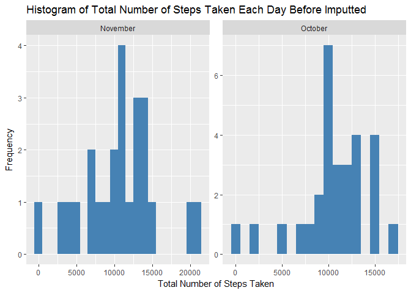
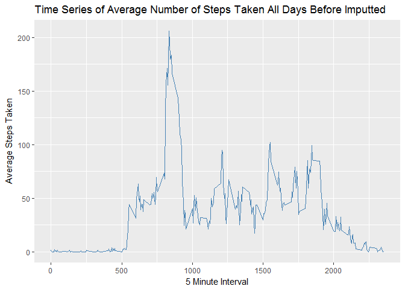
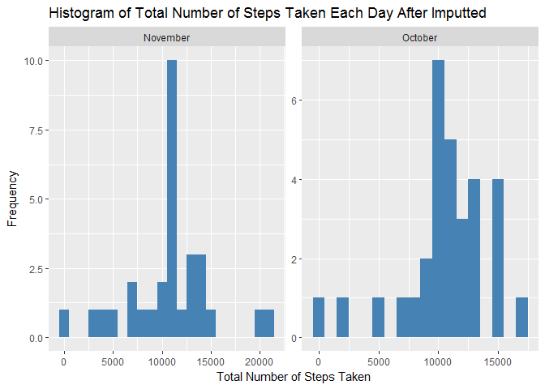
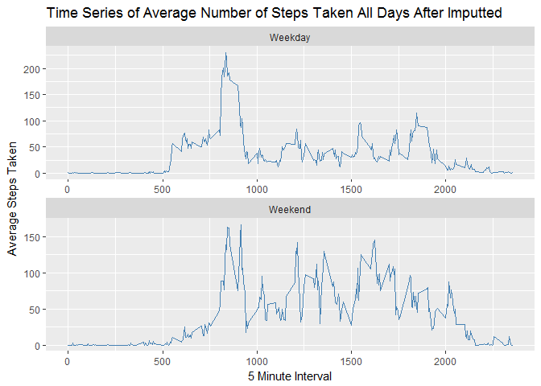

# Reproducible Research: Peer Assessment 1
Paul Phan  
June 2, 2017  


## Loading and preprocessing the data
1. Load the data (i.e.read.csv())
    
    ```r
    file_name<-"C:/Users/phanpa/RepData_PeerAssessment1/activity/activity.csv"
    act<-read.csv(file_name,colClasses = c("integer","Date","factor"))
    ```
    
2. Process/transform the data (if necessary) into a format suitable for your analysis
    
    ```pre
    library(lubridate)
    install.packages("ggplot2")
    library(ggplot2)
    act_tidy<-na.omit(act)
    ```


## What is mean total number of steps taken per day?
1. Calculate the total number of steps taken per day
    
    ```r
    total_steps<-aggregate(steps~date,act,"sum")
    total_steps$month_name<-months(total_steps$date,abbr=FALSE)
    ```
    
2. Make a histogram of the total number of steps taken each day
    
    ```r
    library(ggplot2)
    ```
    
    ```
    ## Warning: package 'ggplot2' was built under R version 3.3.3
    ```
    
    ```r
    ggplot(total_steps,aes(steps)) + geom_histogram(binwidth=1000,fill="steelblue") + facet_wrap(~month_name,scales="free") + labs(title="Histogram of Total Number of Steps Taken Each Day Before Imputted",x="Total Number of Steps Taken",y="Frequency")
    ```
    
    <!-- -->

3. Calculate and report the mean and median of the total number of steps taken per day
    
    Mean total number of steps taken per day:
    
    ```r
    mean(total_steps$steps)
    ```
    
    ```
    ## [1] 10766.19
    ```
    
    Median total number of steps taken per day:
    
    ```r
    median(total_steps$steps)
    ```
    
    ```
    ## [1] 10765
    ```


## What is the average daily activity pattern?
1. Make a time series plot (i.e.type = "l") of the 5-minute interval (x-axis) and the average number of steps taken, averaged across all days (y-axis)

    Calculate the average number of steps taken per day
    
    ```r
    avg_steps<-aggregate(steps~as.numeric(as.character(interval)),act,"mean")
    names(avg_steps)[1]<-"interval"
    ```

    
    ```r
    library(ggplot2)
    ggplot(avg_steps,aes(interval,steps)) + geom_line(col="steelblue") + labs(title="Time Series of Average Number of Steps Taken All Days Before Imputted",x="5 Minute Interval",y="Average Steps Taken")
    ```
    
    <!-- -->

2. Which 5-minute interval, on average across all the days in the dataset, contains the maximum number of steps?

    
    ```r
    #install.packages("sqldf")
    #library(sqldf)
    #result<-sqldf("select interval, max(steps) from avg_steps")
    #result
    
    avg_steps[avg_steps[2]==max(avg_steps[2]),]
    ```
    
    ```
    ##     interval    steps
    ## 104      835 206.1698
    ```

## Imputing missing values
1. Calculate and report the total number of missing values in the dataset (i.e. the total number of rows with NAs)

    
    ```r
    missing_values<-data.frame(sum(is.na(act)),row.names = "Total Number of missing values:")
    names(missing_values)<-"Count"
    missing_values
    ```
    
    ```
    ##                                 Count
    ## Total Number of missing values:  2304
    ```

2. Devise a strategy for filling in all of the missing values in the dataset. The strategy does not need to be sophisticated. For example, you could use the mean/median for that day, or the mean for that 5-minute interval, etc.

    Filling strategy is to use average steps by interval to fill the missing values on matching intervals.

3. Create a new dataset that is equal to the original dataset but with the missing data filled in.
    
    
    ```r
    act_filled <- act 
    for (i in 1:nrow(act_filled)) {
        if (is.na(act_filled$steps[i])) {
            act_filled$steps[i] <- avg_steps[which(act_filled$interval[i] == avg_steps$interval), ]$steps
        }
    }
    ```
    
    
    ```r
    missing_values<-data.frame(sum(is.na(act_filled)),row.names = "Total Number of missing values:")
    names(missing_values)<-"Count"
    missing_values
    ```
    
    ```
    ##                                 Count
    ## Total Number of missing values:     0
    ```


4. Make a histogram of the total number of steps taken each day and Calculate and report the mean and median total number of steps taken per day.

    Calculate the total number of steps taken per day
    
    ```r
    total_steps<-aggregate(steps~date,act_filled,"sum")
    total_steps$month_name<-months(total_steps$date,abbr=FALSE)
    ```

    
    ```r
    library(ggplot2)
    ggplot(total_steps,aes(steps)) + geom_histogram(binwidth=1000,fill="steelblue") + facet_wrap(~month_name,scales="free") + labs(title="Histogram of Total Number of Steps Taken Each Day After Imputted",x="Total Number of Steps Taken",y="Frequency")
    ```
    
    <!-- -->

    Do these values differ from the estimates from the first part of the assignment? 
    
        Answer: Yes, the median increases by 1.19.
    
    Mean total number of steps taken per day:
    
    ```r
    mean(total_steps$steps)
    ```
    
    ```
    ## [1] 10766.19
    ```
    
    Median total number of steps taken per day:
    
    ```r
    median(total_steps$steps)
    ```
    
    ```
    ## [1] 10766.19
    ```
    
    What is the impact of imputing missing data on the estimates of the total daily number of steps?

        Answer: the mean remains the same however the median changes to match the mean.

## Are there differences in activity patterns between weekdays and weekends?

For this part the weekdays() function may be of some help here. Use the dataset with the filled-in missing values for this part.

1. Create a new factor variable in the dataset with two levels - "weekday" and "weekend" indicating whether a given date is a weekday or weekend day.

    
    ```r
    act_filled$week_level<-factor(weekdays(act_filled$date))
    levels(act_filled$week_level)<-list(Weekday=c("Monday","Tuesday","Wednesday","Thursday","Friday"),Weekend=c("Saturday","Sunday"))
    ```

2. Make a panel plot containing a time series plot (i.e.type = "l") of the 5-minute interval (x-axis) and the average number of steps taken, averaged across all weekday days or weekend days (y-axis).

    Calculate the average number of steps taken per day
    
    ```r
    avg_steps<-aggregate(steps~week_level+as.numeric(as.character(interval)),act_filled,"mean")
    names(avg_steps)[2]<-"interval"
    ```

    
    ```r
    library(ggplot2)
    ggplot(avg_steps,aes(interval,steps)) + geom_line(col="steelblue") + facet_wrap(~week_level,scales="free",ncol=1,nrow=2) + labs(title="Time Series of Average Number of Steps Taken All Days After Imputted",x="5 Minute Interval",y="Average Steps Taken")
    ```
    
    <!-- -->
